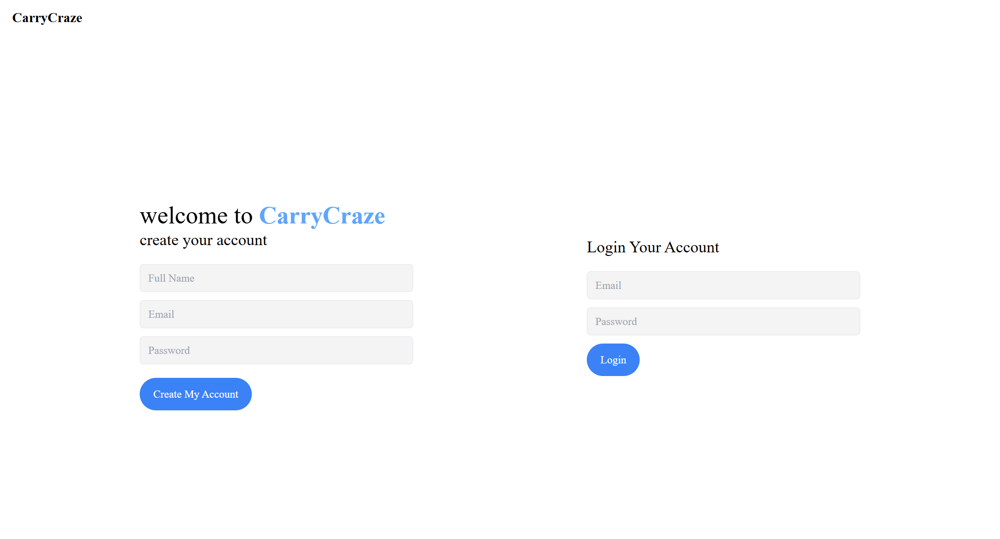
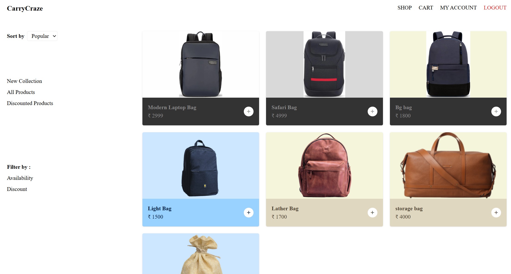
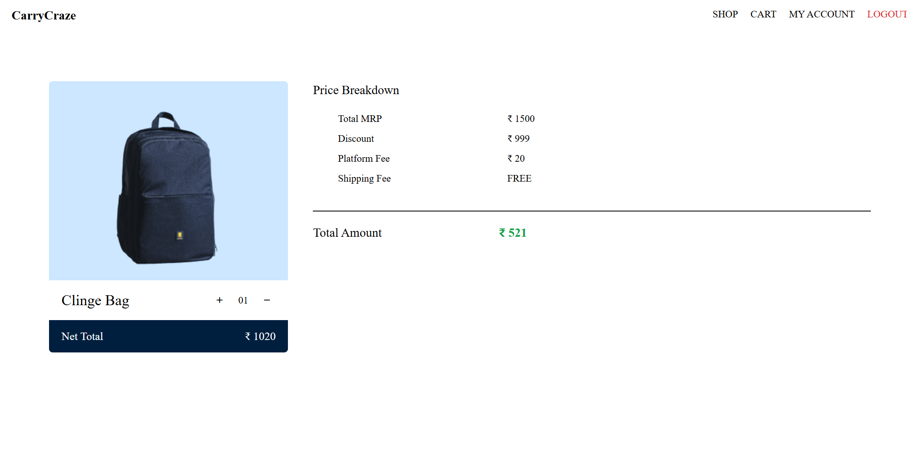

# CarryCraze Store

CarryCraze Store is an online platform dedicated to trendy and stylish bags. From handbags to backpacks, we provide a curated collection for every occasion. This project demonstrates full-stack development skills using **Node.js, Express, MongoDB, and EJS/Tailwind CSS**.

## Features
- Wide range of handbags, backpacks, and accessories
- User-friendly shopping experience
- Secure checkout
- Responsive design for mobile and desktop

## Screenshots

<div align="center">
  
  
  
</div>

## Tech Stack
- Frontend: EJS, HTML, CSS, Tailwind
- Backend: Node.js, Express
- Database: MongoDB

## Installation
Clone the repository:
```bash
git clone git@github.com:SAHIL-DEV-1702/CarryCraze-Store.git
